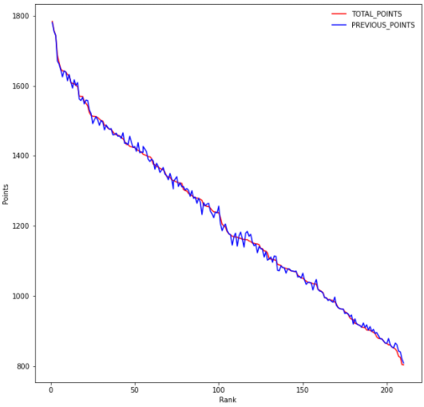
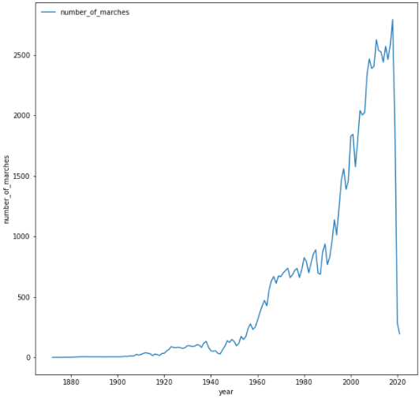
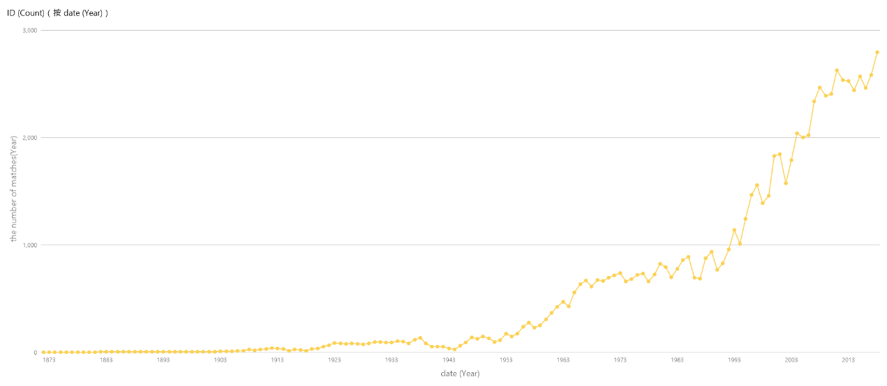
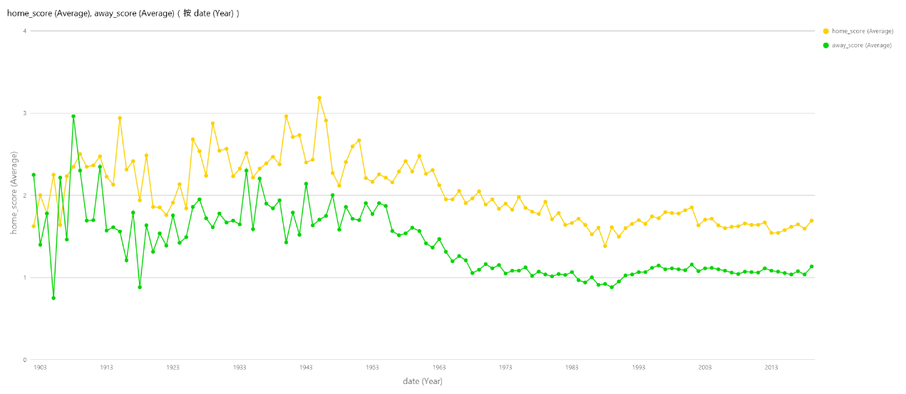

************
Data Process
************

Data Preprocessing
==================

    Raw data crawled from the website will have tabs as well as tables and spaces, we use **beautifulsoap4** to ensure that we collected the data without these useless items.
    Meanwhile, data collected from Kaggle will have unneeded attributes and duplicated data, we use SQL statements to remove them.

Data Analysis
===============

This is the plot showing the relationship between the **points** as well as the *ranking*. It's easy to discover that the changing of points and rankings are generally following a linear relationship with a slope = -1.

This is the plot showing the relationship between the **annual number of matches** as well as the *year*. You can discover that the annual number of matches is increasing rapidly, which shows the football area is becoming more and more prosperous.

This figure reflects the **average number of football matches** from 1873 to now. It can be seen from the figure that with the increase of years, the number of football matches is gradually increasing, and after 1990, it shows a blowout growth, reflecting the continuous expansion of the scale of football.

This graph shows the **number of goals scored per game**, for home team and away team, from the beginning of the 20th century to the present, sorted by year on the horizontal axis, goals scored per game on the vertical axis, goals scored at home in yellow and goals scored away in green. This graph shows two points:

    1. With the development of football, home advantage gradually emerges. In each match, about 0.5 more goals are scored at home than away games;

    2. With the development of football, the average goal per game shows a trend of gradual decline, which also reflects the tactical development of modern football from the side, making the defense of each team better and better.

