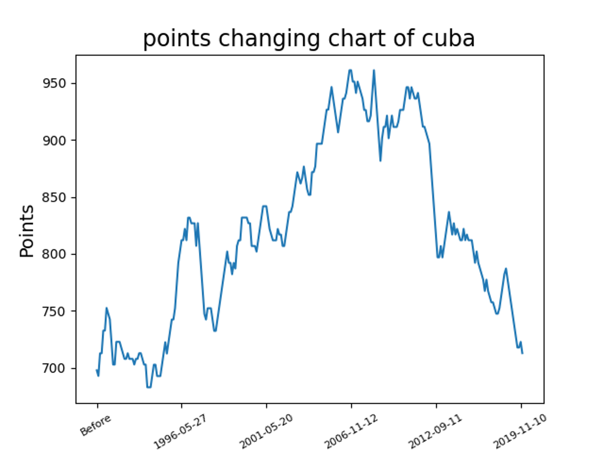

*******************
Project Description
*******************

Background
==========

    Football has become a hot topic with the European Championship and Champions League, and with the rise of virtual currencies, graphics cards have become a hot topic.
Due to time constraints, we chose football and graphics card these two topics as the subjects of our project at first basing on the idea of "double safety". We start these two topics togther at the same time, and if any of them encounter a problem that cannot be solved and thus cannot be carried out, we will switch to another one immediately to avoid wasting time and overdue.

In the users\' feedback from JD of RTX graphics cards part, we scraped the comment time, comment star rating, comment user id and comment content of a certain RTX model by JD customers through the web crawlers. We did get these information initially, but soon Jingdong discovered that we were using crawlers and banned us. So that we finally selected the theme to be the football.

Purpose
=======

    Nowadays, more and more people are becoming fans of football, but there exists a problem: the professional data of football competitions are always charged, while the free data is lack of completeness and analysis.
Thus, we are going to provide a system collected each important football matches and provide the services of view, analysis, as well as prediction.
We implement the powerful big data technology into football really will provide us some unexpected results, which may be revolutionary.

Functionalities
===============

    Our project provides platform for users to query, visualise, as well as view our rankings of most of the countries\' football team, which will help them to have a clear view and intuitional understand of a country\'s football team.
    We shall make a **concept definition** here, our research object is a country\'s football team, thus any "team name" is equivalent to the "country name". In other words, no matter this team is a national team or a leauge team, we always use the country it belongs to as its name.

To be more specific, our application has those functionalities:

    #. Points Data Visualization

        Can visually display the process of points changing for a specific team in a specific time period. An simple example is shown below.

    #. Competition Data Query

        User can query for the competition event by team name, categories (i.e. tournament, competition result), as well as time period (fuzzy searching is suported!)

    #. Competition Data Management

        User can add a new competition into the competition event database, meanwhile, user can modify or delete the newest one of the competition events.

    #. Ranking Viewing

        User can view about the rankings sorted by points, where the points are calculated by our special formula. User can also view the ranking provided by FIFA as well as UEFA for reference.

Declaration: We only allow user to modify the database at the minimum, users are not allowed to delete any other competition event except the newest one, meanwhile, any new country user added by the adding a competition event will not be included in the calculation of points. The reasons for this kind of design is we don't want the user to spoil the database.
Generally a football match's recorded is definite after the competition is over, thus the action of chaning the previous record is not need. Meanwhile, the ranking we provided is carefully selected and calculated based on big data, and any small data user input is relatively lack of reliability.
If user really need to do these process, he should contact the technician to modify on the database on SQL level.

