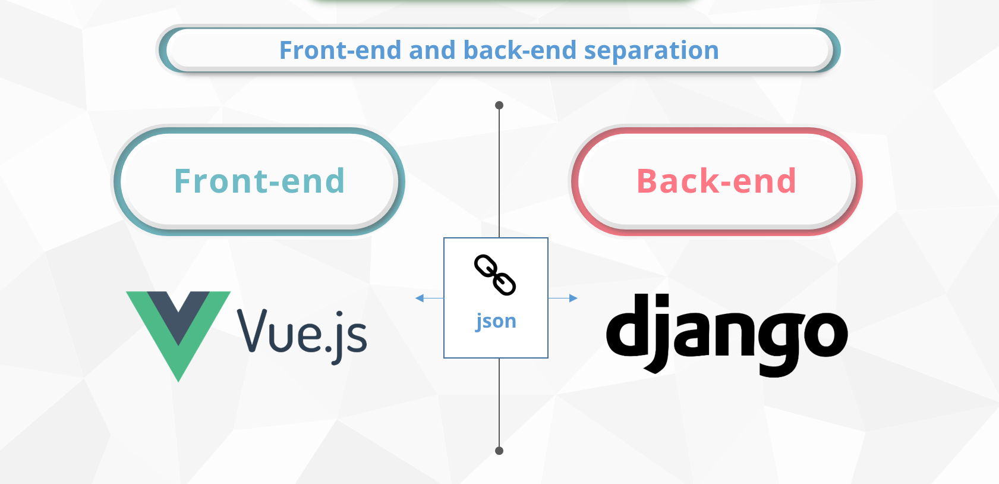
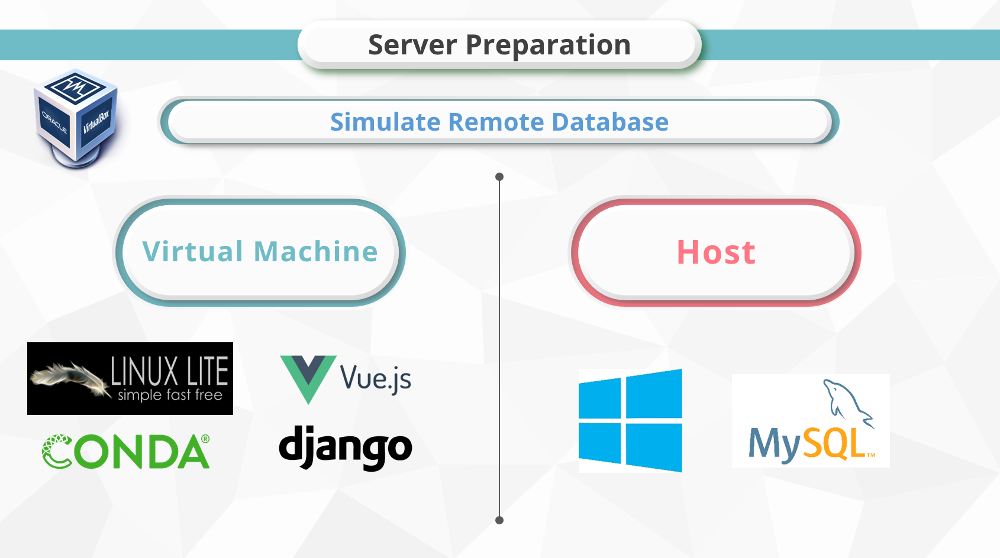

*******************
Website Application
*******************

Development Architecture
========================

We use the "Front-end and back-end separation" development mode, for the front-end we use **vue.js**, and for the back-end we use **django**.

Server Configuration
====================

We use virtual machine to simulate the case that the database server and the application server is not on the same host machine.

feature implementation
======================

Feature implementation is introduced at the first chapter "Project Description".
